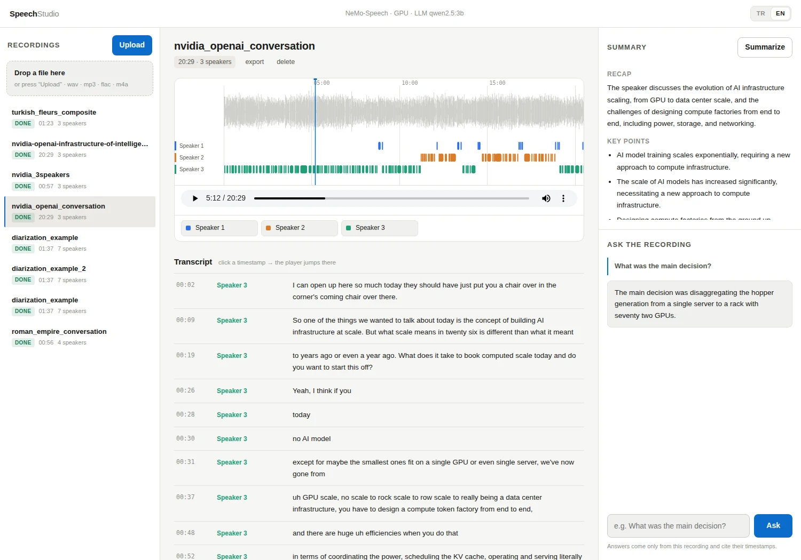
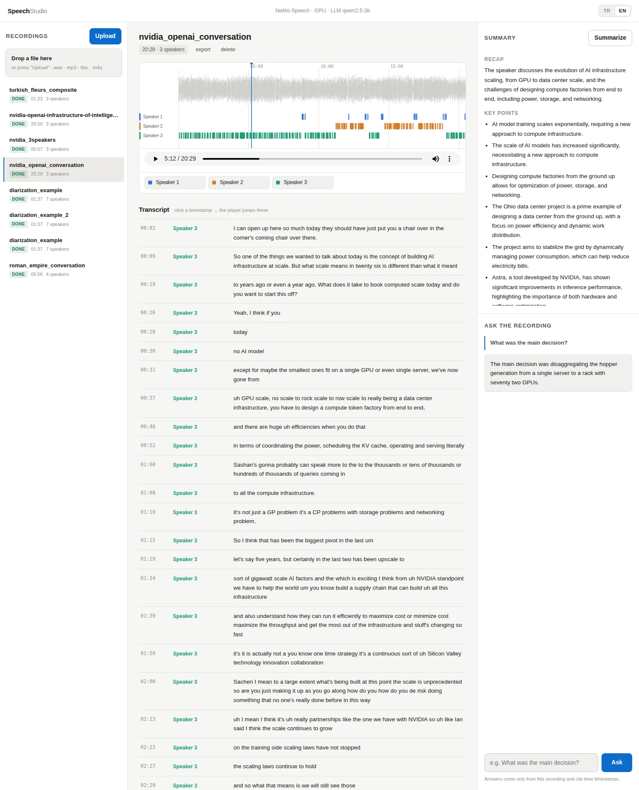

<div align="center">

# Speech Studio

**Local transcription, speaker diarization, summaries and Q&A for audio recordings, running on an NVIDIA Jetson.**

English · [Türkçe](README.tr.md)



</div>

Drop in a meeting, interview or podcast recording and Speech Studio shows you
**who spoke when** on a color-coded timeline, a **speaker-labelled
transcript**, a **summary**, and lets you **ask questions about the
recording**. Everything runs on the device: the audio never leaves your Jetson.

## Features

- **Speaker diarization:** every speaker gets their own color and lane on the timeline, so you can see at a glance who talks where.
- **Transcript:** timestamped, speaker-labelled turns. Click a line and the player jumps to that moment.
- **Rename speakers:** turn "Speaker 1" into "Ayşe" with a click.
- **Summary:** a short recap, key points, and decisions/action items.
- **Ask the recording:** answers are grounded in the transcript and cite `[mm:ss]` timestamps you can check.
- **Markdown export:** summary plus transcript in one file.
- **Turkish / English:** switch the interface with the TR · EN toggle; summaries and answers are generated in the selected language.
- **Formats:** WAV, MP3, FLAC, OGG, Opus, M4A (up to 500 MB).



## How it works

```
audio file ──► [NeMo-Speech.cpp container, GPU] ──► speakers + transcript
                          │  loopback only
                          ▼
               [your Ollama container] ──► summary + answers
```

| Component | Role |
|---|---|
| [NeMo-Speech.cpp](https://github.com/NVIDIA/NeMo-Speech.cpp) | NVIDIA's ggml-based local inference engine, built as a Docker image. Runs ASR and diarization on the Jetson GPU, one container per job. |
| [Nemotron-3-Diarization](https://huggingface.co/nvidia/Nemotron-3-Diarization) | Who spoke when, up to 8 speakers, with word-level speaker labels. |
| ASR models | `nemotron-3.5` (default, multilingual), `parakeet-tdt`, `parakeet-ctc`, `nemotron-en`. |
| [Ollama](https://ollama.com) | Summaries and Q&A with the model of your choice (default `qwen2.5:3b`). Speech Studio only talks to your existing container; it never stops it or removes models. |
| Web console | Python/FastAPI + plain JS, bound to `127.0.0.1` only. Reach it from another machine through an SSH tunnel. |

## Requirements

- NVIDIA Jetson Orin (tested on **Orin Nano Developer Kit 8 GB**, JetPack 6.0 / L4T R36, CUDA 12.2)
- Docker with the NVIDIA Container Runtime
- `git`, `curl`, `ffmpeg`, `python3`
- An Ollama container (optional, only needed for summaries and Q&A)

## Quick start

```bash
git clone https://github.com/openzeka/speech-studio.git
cd speech-studio
bash install.sh
```

The installer:

1. checks the prerequisites,
2. clones NeMo-Speech.cpp into `vendor/` and applies the Jetson build fixes,
3. builds the `speech-nemo:local` image (the first build takes a while),
4. downloads the ASR and diarization models you pick into `model-cache/` and verifies each against its pinned SHA-256,
5. pulls the LLM you pick into your Ollama container,
6. installs the web console as a systemd user service.

Non-interactive install:

```bash
bash install.sh --asr nemotron-3.5 --diar nemotron-3-diarization --llm qwen2.5:3b --non-interactive
bash install.sh --help      # all flags
bash install.sh --dry-run   # print the plan, change nothing
```

Open the console from your own computer:

```bash
ssh -N -L 17841:127.0.0.1:17841 <user>@<jetson>
# then browse to http://localhost:17841/
```

## Results on Orin Nano 8 GB

| Recording | Length | Result |
|---|---|---|
| [NVIDIA × OpenAI conversation](https://www.youtube.com/watch?v=KT89PEe9d7U) (screenshots above) | 20 min 30 s | 3 speakers, 187 turns |
| Synthetic dialogue with seven voices | 1 min 38 s | 7 speakers |
| Three-person podcast clips | ~1 min | 3 speakers, speaker changes detected correctly |
| Turkish read speech (FLEURS) | 1 min 24 s | Turkish transcript and summary |

The speech models total under 2 GB and ran alongside Ollama in 8 GB of memory.

> Transcripts and summaries are model output. Proper names in particular can
> be misspelled, and summaries can be wrong. Use the timestamps to check
> against the original audio.

## Jetson build notes

Building NVIDIA's sources on Jetson hit four compatibility issues. `install.sh` fixes all of them automatically:

1. **`gcc-13` missing** on Ubuntu 22.04 → builds with `gcc-12`.
2. **CMake 3.22 < required 3.26** → installs a current CMake via pip.
3. **`libcudart.so.12` not found** → arm64 images keep CUDA libs under `targets/sbsa-linux`, which is added to the loader path.
4. **`cublasCreate` resource error** → Tegra has no cuda-compat and the server-oriented SBSA cuBLAS fails, so JetPack's own `libcublas.so.12` is mounted into the container at run time.

Keep the CUDA toolchain matched to the Jetson driver (CUDA 12.2 here). A newer toolchain than the driver supports can produce wrong results on Tegra.

## Usage notes

- All data lives under `library/<id>/` (audio, transcript, summary, Q&A history). Copy or delete it as you like.
- The NeMo container runs per job (`docker run --rm`); only the web console is a persistent service.
- `scripts/nemo-run.sh` runs the NeMo-Speech CLI by hand, `scripts/smoke.sh <audio>` runs an end-to-end test.
- Only uploaded files are supported for now; live streaming is not wired into the UI yet.
- Supported transcription languages depend on the ASR model you choose.

```bash
systemctl --user status speech-studio     # service status
journalctl --user -u speech-studio -f     # logs
```

## Documentation (Turkish)

- [docs/KURULUM.md](docs/KURULUM.md): installation, model downloads, troubleshooting
- [docs/MODELLER.md](docs/MODELLER.md): model descriptions, formats, hardware notes

## License

Speech Studio is released under the [MIT license](LICENSE). NeMo-Speech.cpp is Apache-2.0,
and the NVIDIA models are under OpenMDW 1.1, which permits commercial use.
