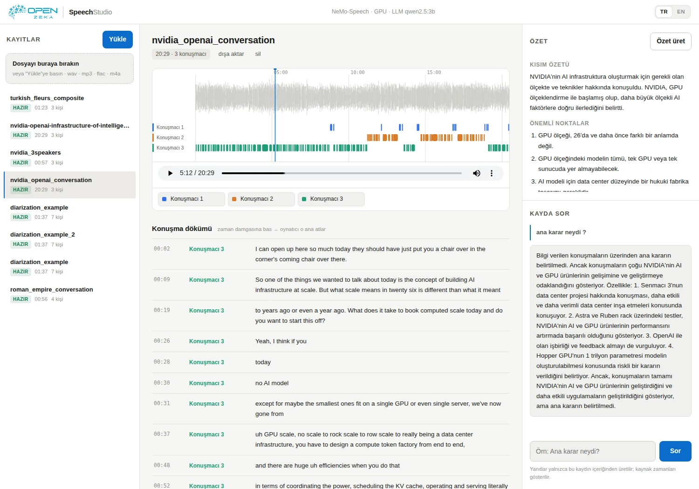
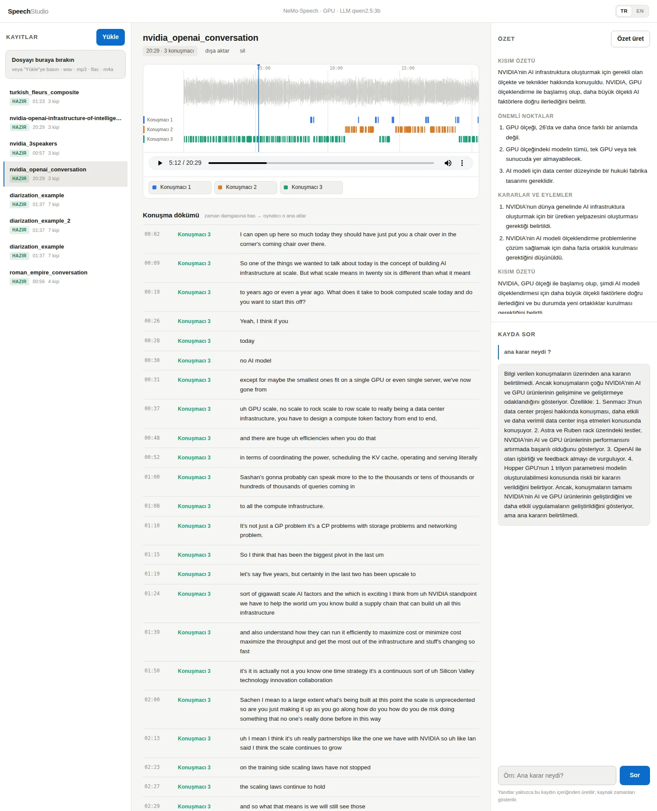

<div align="center">

# Speech Studio

**NVIDIA Jetson üzerinde ses kayıtları için yerel döküm, konuşmacı ayrımı, özet ve soru-cevap.**

[English](README.md) · Türkçe



</div>

Bir toplantı, röportaj ya da podcast kaydını sürükleyip bırakın; Speech Studio
**kimin ne zaman konuştuğunu** renkli bir zaman çizelgesinde, **konuşmacı
etiketli dökümü**, **özeti** gösterir ve **kayda soru sormanızı** sağlar.
Her şey cihazda çalışır; ses dosyası Jetson'dan dışarı çıkmaz.

## Özellikler

- **Konuşmacı ayrımı:** Her konuşmacı zaman çizelgesinde kendi rengi ve şeridiyle gösterilir; kaydın neresinde kimin konuştuğu bir bakışta görülür.
- **Konuşma dökümü:** Zaman damgalı, konuşmacı etiketli turlar. Bir satıra tıklayınca oynatıcı o ana atlar.
- **Konuşmacı adlandırma:** "Konuşmacı 1"i tek tıkla "Ayşe" yapın.
- **Özet:** Kısa özet, önemli noktalar, kararlar ve yapılacaklar.
- **Kayda sor:** Yanıtlar yalnızca dökümden üretilir ve kontrol edebileceğiniz `[mm:ss]` zaman damgalarını gösterir.
- **Markdown dışa aktarma:** Özet ve döküm tek dosyada.
- **Türkçe / İngilizce:** Arayüz TR · EN düğmesiyle değişir; özet ve yanıtlar seçilen dilde üretilir.
- **Biçimler:** WAV, MP3, FLAC, OGG, Opus, M4A (500 MB'a kadar).



## Nasıl çalışır?

```
ses kaydı ──► [NeMo-Speech.cpp konteyneri, GPU] ──► konuşmacılar + döküm
                          │  yalnız yerel bağlantı (loopback)
                          ▼
               [Ollama konteyneriniz] ──► özet + soru cevapları
```

| Bileşen | Görevi |
|---|---|
| [NeMo-Speech.cpp](https://github.com/NVIDIA/NeMo-Speech.cpp) | NVIDIA'nın ggml tabanlı yerel çıkarım motoru; Docker imajı olarak derlenir. ASR ve konuşmacı ayrımını Jetson GPU'sunda, her iş için ayrı konteynerde çalıştırır. |
| [Nemotron-3-Diarization](https://huggingface.co/nvidia/Nemotron-3-Diarization) | Kimin ne zaman konuştuğunu bulur; 8 konuşmacıya kadar, kelime düzeyinde etiketler. |
| ASR modelleri | `nemotron-3.5` (varsayılan, çok dilli), `parakeet-tdt`, `parakeet-ctc`, `nemotron-en`. |
| [Ollama](https://ollama.com) | Seçtiğiniz modelle özet ve soru-cevap (varsayılan `qwen2.5:3b`). Speech Studio mevcut konteynerinizi yalnızca kullanır; durdurmaz, modelleri silmez. |
| Web arayüzü | Python/FastAPI + sade JS, yalnızca `127.0.0.1`'e bağlanır. Başka bir bilgisayardan SSH tüneliyle erişilir. |

## Gereksinimler

- NVIDIA Jetson Orin (**Orin Nano Developer Kit 8 GB**, JetPack 6.0 / L4T R36, CUDA 12.2 üzerinde test edildi)
- Docker ve NVIDIA Container Runtime
- `git`, `curl`, `ffmpeg`, `python3`
- Bir Ollama konteyneri (isteğe bağlı; yalnızca özet ve soru-cevap için gerekir)

## Hızlı başlangıç

```bash
git clone https://github.com/openzeka/speech-studio.git
cd speech-studio
bash install.sh
```

Kurulum betiği:

1. ön koşulları denetler,
2. NeMo-Speech.cpp'yi `vendor/` altına klonlar ve Jetson derleme düzeltmelerini uygular,
3. `speech-nemo:local` imajını derler (ilk derleme biraz sürer),
4. seçtiğiniz ASR ve konuşmacı ayrımı modellerini `model-cache/` altına indirir ve her birini sabitlenmiş SHA-256 değeriyle doğrular,
5. seçtiğiniz dil modelini Ollama konteynerinize çeker,
6. web arayüzünü systemd kullanıcı servisi olarak kurar.

Etkileşimsiz kurulum:

```bash
bash install.sh --asr nemotron-3.5 --diar nemotron-3-diarization --llm qwen2.5:3b --non-interactive
bash install.sh --help      # tüm seçenekler
bash install.sh --dry-run   # planı yazdırır, hiçbir şeyi değiştirmez
```

Arayüzü kendi bilgisayarınızdan açın:

```bash
ssh -N -L 17841:127.0.0.1:17841 <kullanici>@<jetson>
# ardından tarayıcıda: http://localhost:17841/
```

## Orin Nano 8 GB üzerinde sonuçlar

| Kayıt | Süre | Sonuç |
|---|---|---|
| [NVIDIA × OpenAI sohbeti](https://www.youtube.com/watch?v=KT89PEe9d7U) (yukarıdaki ekran görüntüleri) | 20 dk 30 sn | 3 konuşmacı, 187 konuşma bölümü |
| Yedi farklı sesle oluşturulan yapay diyalog | 1 dk 38 sn | 7 konuşmacı |
| Üç kişilik podcast kesitleri | ~1 dk | 3 konuşmacı; konuşmacı geçişleri doğru tespit edildi |
| Türkçe okuma derlemesi (FLEURS) | 1 dk 24 sn | Türkçe döküm ve özet |

Ses modellerinin toplam boyutu 2 GB'ın altında; 8 GB bellekte Ollama ile birlikte çalıştı.

> Döküm ve özet model çıktısıdır. Özellikle özel adlar yanlış yazılabilir,
> özet hata içerebilir. Zaman damgalarıyla özgün kayda dönüp kontrol edin.

## Jetson derleme notları

NVIDIA'nın kaynak kodunu Jetson'da derlerken dört uyumluluk sorunu çıktı. `install.sh` hepsini otomatik düzeltir:

1. **`gcc-13` paketi yok** (Ubuntu 22.04) → `gcc-12` ile derlenir.
2. **CMake 3.22 < gereken 3.26** → güncel CMake pip ile kurulur.
3. **`libcudart.so.12` bulunamıyor** → arm64 imajlarında CUDA kitaplıkları `targets/sbsa-linux` altında; bu dizin kitaplık arama yoluna eklenir.
4. **`cublasCreate` kaynak hatası** → Tegra'da cuda-compat yok ve sunuculara yönelik SBSA cuBLAS hata veriyor; JetPack'in kendi `libcublas.so.12` dosyası çalışma anında konteynere bağlanır.

CUDA araç zincirini Jetson sürücüsüyle uyumlu tutun (burada CUDA 12.2). Sürücünün desteklediğinden yeni bir araç zinciri Tegra'da hatalı sonuç üretebilir.

## Kullanım notları

- Tüm veri `library/<id>/` altındadır (ses, döküm, özet, soru geçmişi); kopyalanabilir, silinebilir.
- NeMo konteyneri iş başına çalışır (`docker run --rm`); kalıcı servis yalnızca web arayüzüdür.
- `scripts/nemo-run.sh` NeMo-Speech CLI'ını elle çalıştırır, `scripts/smoke.sh <ses>` uçtan uca test yapar.
- Şimdilik yalnızca yüklenen dosyalar destekleniyor; canlı ses akışı arayüze henüz eklenmedi.
- Dökümde desteklenen diller seçtiğiniz ASR modeline bağlıdır.

```bash
systemctl --user status speech-studio     # servis durumu
journalctl --user -u speech-studio -f     # günlükler
```

## Belgeler

- [docs/KURULUM.md](docs/KURULUM.md): kurulum, model indirme, sorun giderme
- [docs/MODELLER.md](docs/MODELLER.md): modellerin tanımı, biçimleri, donanım notları

## Lisans

Speech Studio [MIT lisansıyla](LICENSE) sunulur. NeMo-Speech.cpp Apache-2.0 lisanslıdır;
NVIDIA modelleri ticari kullanıma da izin veren OpenMDW 1.1 lisansına tabidir.
